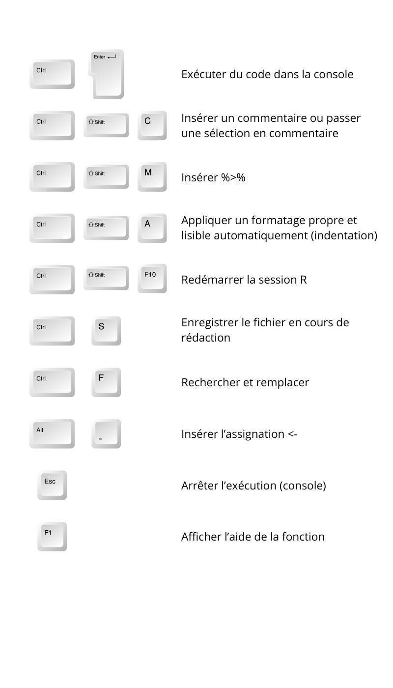

Boostez votre productivité sur RStudio avec ces 10 raccourcis indispensables ! Exécutez du code en un clin d’œil, naviguez rapidement entre les fichiers, formatez votre script proprement et commentez en un geste. Que vous soyez débutant ou expert, ces raccourcis vous feront gagner un temps précieux et optimiseront votre workflow. 🚀💡 

Si vous voulez tester vos connaissances en R :  [Quiz1](../Quizs/1_raccourcis_Rstudio_quiz.qmd)